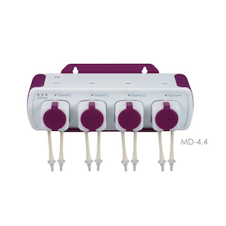

# Jebao Dosing Pump Python Library

Python library for controlling Jebao Dosing Pump MD 4.4 via TCP/IP.

[](https://opensource.org/licenses/MIT)
[](https://www.python.org/downloads/)


[]()

## Overview

This library provides a Python interface to control Jebao Dosing Pump MD 4.4 via TCP/IP on your LAN. It is heavily based on the awesome work by [tancou](https://github.com/tancou/jebao-dosing-pump-md-4.4).
It implements the TCP protocol for communication with the device, allowing you to:

- Start and stop individual pumps (1-4)
- Query device status and sensor data
- Maintain persistent connections with automatic reconnection
- Use async context managers for clean resource management

## Installation

**With pip:**
```bash
pip install jebao-md44
```

**With uv (recommended for development):**
```bash
git clone https://github.com/loomsen/python-jebao-md-4.4.git
cd python-jebao-md-4.4
uv sync --group dev
```


## Device Discovery

You can simply run the discovery.py script in the examples directory to find Jebao devices on your local network:

```bash
$ python  examples/discovery.py
Discovering Jebao devices...
Waiting 5 seconds for responses...

INFO:jebao.discovery:Discovered Jebao device g3BxNc1vETeib5zTN6Goq at 192.168.1.108
Found 1 device(s):

Device 1:
  Device ID: g3BxNc1vETeib5zTN6Goq
  IP Address: 192.168.1.108
  Version: 03030000
  API Server: euapi.gizwits.com:80
  Data1 (MAC): 1234567890AB
  Data2: 65666566
  Data3 (Key): 012345678901234567890123456789012

```

Or to programmatically discover Jebao devices on your local network using UDP broadcast:

```python
import asyncio
from jebao_md44 import discover_jebao_devices

async def main():
    # Discover devices (waits 5 seconds for responses)
    devices = await discover_jebao_devices(timeout=5.0)

    for device in devices:
        print(f"Found device: {device.device_id}")
        print(f"  IP: {device.ip}")
        print(f"  Version: {device.version}")
        print(f"  API Server: {device.api_server}")

asyncio.run(main())
```

For more control over the discovery process:

```python
from jebao_md44 import JebaoDiscovery

async def main():
    discovery = JebaoDiscovery(
        listen_address="0.0.0.0",  # Bind address
        timeout=10.0                # Extended timeout
    )
    devices = await discovery.discover()

asyncio.run(main())
```


## Quick Start

```python
import asyncio
from jebao import JebaoDevice

async def main():
    # Create device instance
    device = JebaoDevice(ip="192.168.1.100")

    # Connect and login
    await device.connect()
    await device.login()

    # Retrieve device data (required before sending commands)
    data = await device.retrieve_data()
    print(f"Device data: {data}")

    # Start pump 1
    await device.start_pump(1)
    await asyncio.sleep(2)

    # Stop pump 1
    await device.stop_pump(1)

    # Disconnect
    await device.disconnect()

# Run
asyncio.run(main())
```


## Usage with Context Manager

```python
import asyncio
from jebao_md44 import JebaoDevice

async def main():
    async with JebaoDevice(ip="192.168.1.100") as device:
        # Device is automatically connected and logged in
        await device.retrieve_data()
        await device.start_pump(2)
        await asyncio.sleep(5)
        await device.stop_pump(2)
    # Device is automatically disconnected

asyncio.run(main())
```

## Advanced Features

### Automatic Reconnection

The library supports automatic reconnection if the connection is lost:

```python
device = JebaoDevice(
    ip="192.168.1.100",
    auto_reconnect=True,  # Enable automatic reconnection
    ping_interval=4.0      # Keep-alive ping every 4 seconds
)
```

### Custom Ping Interval

Adjust the keep-alive ping interval (default is 4 seconds):

```python
device = JebaoDevice(
    ip="192.168.1.100",
    ping_interval=10.0  # Ping every 10 seconds
)
```

### Disable Keep-Alive Pings

```python
device = JebaoDevice(
    ip="192.168.1.100",
    ping_interval=0  # Disable pings
)
```

## API Reference

### `discover_jebao_devices(timeout: float = 5.0) -> list[JebaoDeviceInfo]`

Convenience function to discover Jebao devices on the local network via UDP broadcast.

**Parameters:**
- `timeout` (float): Discovery timeout in seconds. Default: `5.0`

**Returns:** List of `JebaoDeviceInfo` objects for discovered devices.

**Example:**
```python
devices = await discover_jebao_devices(timeout=10.0)
for device in devices:
    print(f"Found: {device.device_id} at {device.ip}")
```

### `JebaoDiscovery`

Class for discovering Jebao devices with more control over the process.

#### Parameters

- `listen_address` (str, optional): Address to bind UDP socket to. Default: `"0.0.0.0"`
- `timeout` (float, optional): Discovery timeout in seconds. Default: `5.0`

#### Methods

##### `async discover() -> list[JebaoDeviceInfo]`

Discover Jebao devices on the network by sending UDP broadcast.

**Returns:** List of discovered devices.

### `JebaoDeviceInfo`

Dataclass containing information about a discovered device.

#### Attributes

- `ip` (str): Device IP address
- `device_id` (str): Unique device identifier
- `data1` (str): MAC address (hex string)
- `data2` (str): Additional device data (hex string)
- `data3` (str): Device key (hex string)
- `api_server` (str): API server endpoint
- `version` (str): Firmware version

### `JebaoDevice`

Main class for controlling the dosing pump.

#### Parameters

- `ip` (str): IP address of the device
- `auto_reconnect` (bool, optional): Enable automatic reconnection. Default: `True`
- `ping_interval` (float, optional): Keep-alive ping interval in seconds. Default: `4.0`. Set to `0` to disable.

#### Methods

##### `async connect() -> bool`

Connect to the device via TCP.

**Returns:** `True` if connection successful, `False` otherwise.

##### `async login() -> bool`

Authenticate with the device.

**Returns:** `True` if login successful, `False` otherwise.

##### `async retrieve_data() -> Optional[dict]`

Retrieve device status and sensor data. **Must be called before sending pump commands.**

**Returns:** Dictionary with device data or `None` on error.

##### `async start_pump(pump_number: int) -> bool`

Start a specific pump.

**Parameters:**
- `pump_number` (int): Pump number (1-4)

**Returns:** `True` if successful, `False` otherwise.

##### `async stop_pump(pump_number: int) -> bool`

Stop a specific pump.

**Parameters:**
- `pump_number` (int): Pump number (1-4)

**Returns:** `True` if successful, `False` otherwise.

##### `async disconnect()`

Disconnect from the device and clean up resources.

## Protocol Details

This library implements the Jebao TCP protocol:

- **TCP Port:** 12416
- **Authentication:** Passcode-based login sequence
- **Keep-alive:** Optional ping-pong mechanism
- **Message Types:**
  - `0x06`: Passcode request
  - `0x07`: Passcode response
  - `0x08`: Login request
  - `0x09`: Login response
  - `0x15`: Ping request
  - `0x16`: Pong response
  - `0x90`: Data request
  - `0x91`: Data response
  - `0x93`: Pump action command
  - `0x94`: Action acknowledgment

## Supported Devices

- Jebao MD-4.4 WiFi Dosing Pump

Other Jebao WiFi-enabled dosing pumps may work but have not been tested.

## Troubleshooting

### Connection Issues

1. Ensure the device is powered on and connected to your network
2. Verify the IP address is correct
3. Check that port 12416 is not blocked by firewalls
4. Try disabling and re-enabling WiFi on the device

### Commands Not Working

Always call `retrieve_data()` before sending pump commands. The device requires this initialization step:

```python
await device.retrieve_data()  # Required!
await device.start_pump(1)
```

### Connection Drops

Enable automatic reconnection:

```python
device = JebaoDevice(ip="192.168.1.100", auto_reconnect=True)
```

## Contributing

Contributions are welcome! Please feel free to submit a Pull Request.

1. Fork the repository
2. Create your feature branch (`git checkout -b feature/amazing-feature`)
3. Commit your changes (`git commit -m 'Add some amazing feature'`)
4. Push to the branch (`git push origin feature/amazing-feature`)
5. Open a Pull Request

## Development

### Setup Development Environment

This project uses [uv](https://docs.astral.sh/uv/) for dependency management.

```bash
# Clone the repository
git clone https://github.com/loomsen/python-jebao-md-4.4.git
cd python-jebao-md-4.4

# Sync dependencies (creates .venv and installs all dependencies)
uv sync --group dev

# Run tests
uv run pytest

# Run tests with coverage
uv run pytest --cov=jebao --cov-report=term --cov-report=html

# Run formatters and linters
uv run black .
uv run ruff check .
uv run mypy jebao

# Or activate the virtual environment
source .venv/bin/activate
pytest
black .
ruff check .
```

### Running Tests

```bash
pytest tests/
```

## License

This project is licensed under the MIT License - see the [LICENSE](LICENSE) file for details.

## Acknowledgments

This project is heavily inspired by and builds upon the excellent work from:
- [tancou/jebao-dosing-pump-md-4.4](https://github.com/tancou/jebao-dosing-pump-md-4.4) - Original protocol reverse engineering and Node.js implementation

## Author

**Norbert Varzariu**
- Email: loomsen < at > gmail.com
- GitHub: [@loomsen](https://github.com/loomsen)

## Support

If you encounter any issues or have questions, please [open an issue](https://github.com/loomsen/python-jebao-md-4.4/issues) on GitHub.
